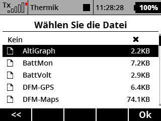
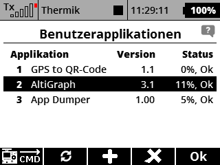
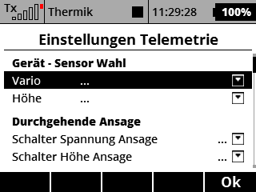
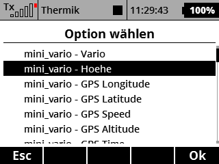
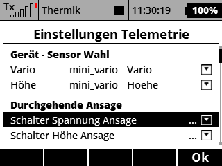
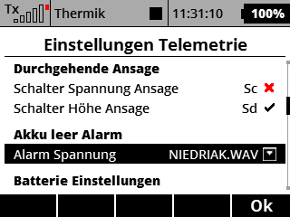
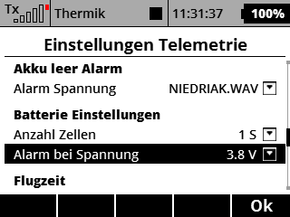
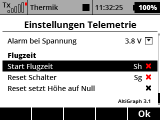
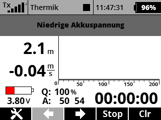
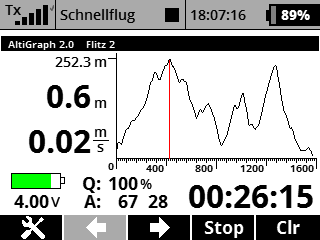

# AltiGraph

Lua script for Jeti DC/DS-1X (II). Displays and graphs altitude data and shows some other info

   
* Runs on any Jeti DS/DC TX with FW 4.27 and above
* Translations DE and EN
* Switchable and repeated announcements of voltage and altitude
* If both switches are on, flight time will be announced
* Alarm voice for undervoltage  

Install as follows:

Apps/AltiGraph.lua (or .lc)

Apps/AltiGraph/Screen.lua (or .lc)

Apps/AltiGraph/Form.lua (or .lc)

Apps/Lang/AltiGraph.jsn
 

